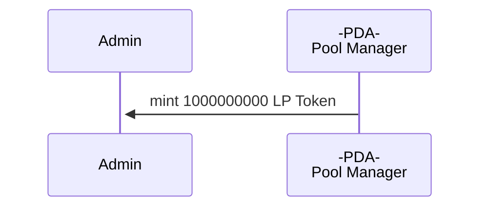
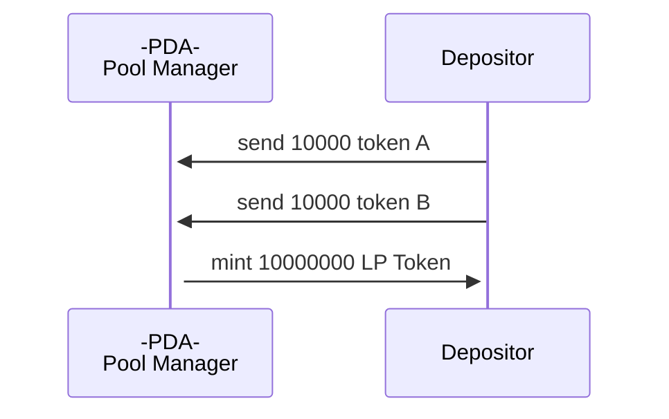
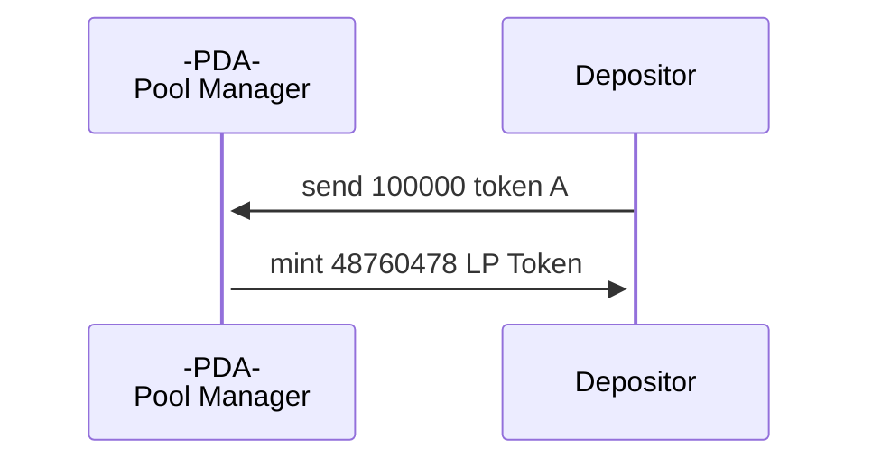
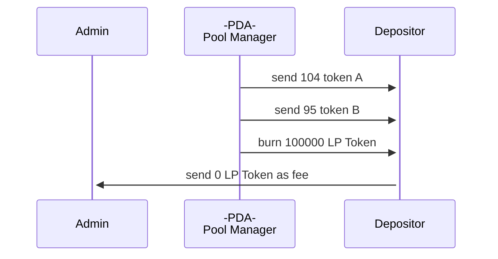
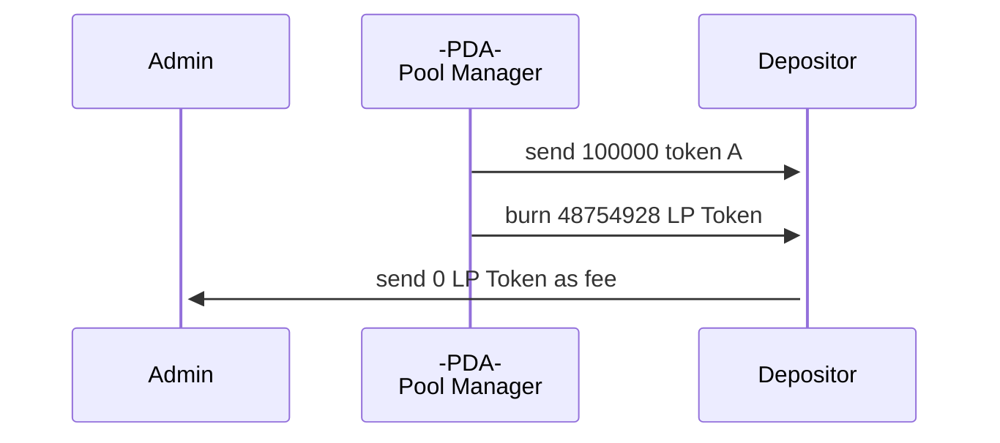
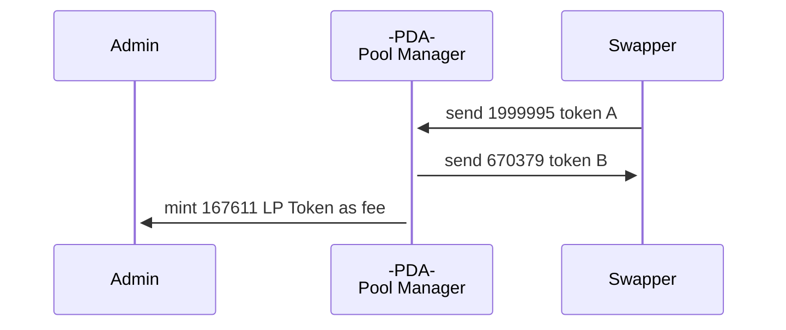
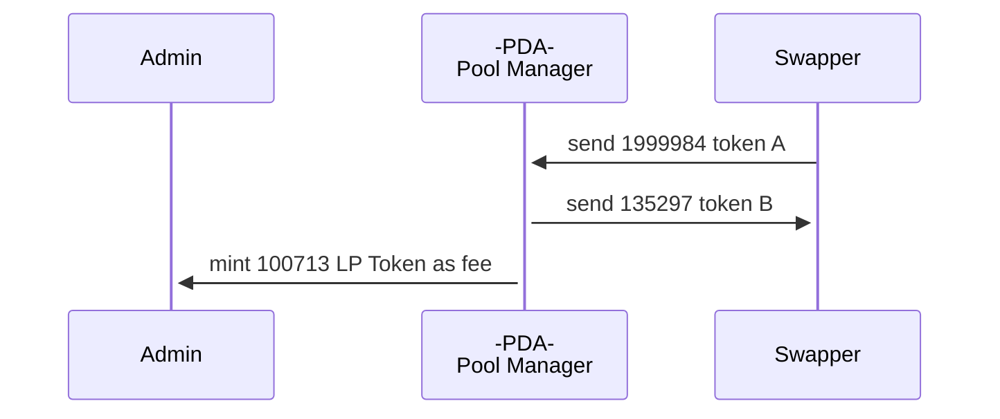
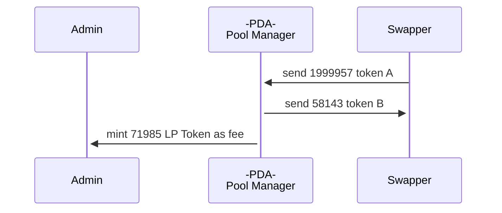
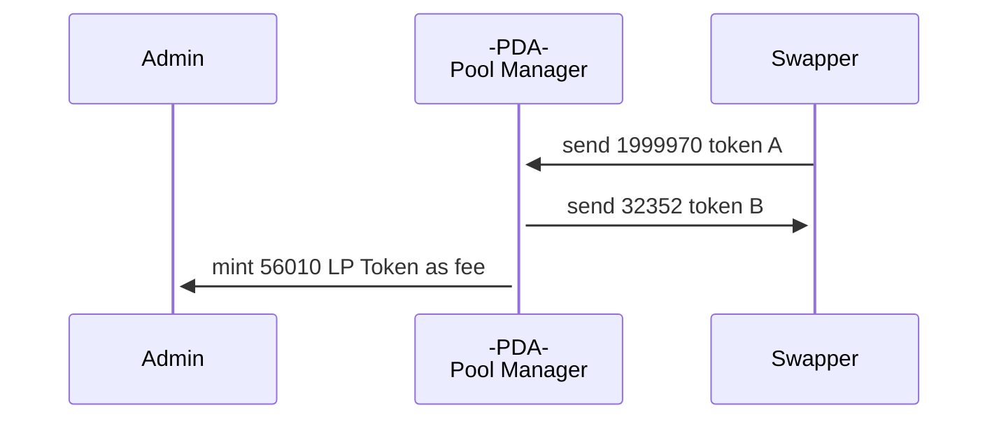
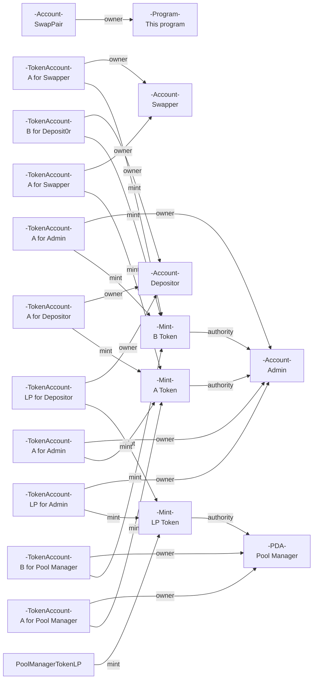

# anchor-liquidity-pool

This is the example [anchor](https://github.com/coral-xyz/anchor) implementation for [solana-swap](https://github.com/solana-labs/solana-program-library/tree/master/token-swap).
* The curve is always `ConstantProduct` in this implementation.
* The fee receiver is always Admin.

## Run

Build the solana program
```
export ADMIN_PUBKEY=`solana address`
npm run build
```

Run validator on the localnet

```
npm run validator
```

Get 10 SOL by airdrop and deploy program for localnet.
```
npm run deploy
```

Run the test(Create Pool / Deposit / Withdrow / Swap). 

```
npm run test
```

### Initialize 

```
┌─────────┬────────────────┬────────────────────────────────────────────────┬────────────────────────────────────────────────┬────────────┐
│ (index) │      name      │                    address                     │                     owner                      │   amount   │
├─────────┼────────────────┼────────────────────────────────────────────────┼────────────────────────────────────────────────┼────────────┤
│    0    │ 'A for UserA'  │ 'J8a4ENEMgUHHfAz9VH2BuApK6mS8mjcUZjHeBypKN1KE' │ 'EwznK8BuBdn918if9jeG3oBomZTpRi8ZHxcCeGXokGaL' │  1000000   │
│    1    │ 'B for UserA'  │ 'GmRp3YGmWFc2or9BkBuiANS9GZ7BEqxrg1ZPpCYvRqc2' │ 'EwznK8BuBdn918if9jeG3oBomZTpRi8ZHxcCeGXokGaL' │  1000000   │
│    2    │ 'LP for UserA' │ '7BBxTGPFKxLmKVj6LV3yE6ojG9kFzRpFnunFxrsT7sW6' │ 'EwznK8BuBdn918if9jeG3oBomZTpRi8ZHxcCeGXokGaL' │     0      │
│    3    │  'A for PDA '  │ 'BVJohxH1hogZdcYBrTMuo7EVk9TSrjdGhrya4zzrGC7p' │ 'DtW9VUU8AtGSyrAo2kMH2rvJhjz97oLh5qfg1Ckubt5N' │  1000000   │
│    4    │  'B for PDA '  │ '9HRgCPn4nj415xayTHhLFqQrpWePPzewEmAqbUBDbtgZ' │ 'DtW9VUU8AtGSyrAo2kMH2rvJhjz97oLh5qfg1Ckubt5N' │  1000000   │
│    5    │ 'LP for Admin' │ '7XAnDxYcCRRSKewLdMnqtrwhjnbUd2Kvq5FfG8xMdRsp' │ '9HKfUqNdHdgn4gYMjCrSoLAmY5USgwpfBSPdeW573ycc' │ 1000000000 │
└─────────┴────────────────┴────────────────────────────────────────────────┴────────────────────────────────────────────────┴────────────┘
```

### DepositAll

```
┌─────────┬────────────────┬────────────────────────────────────────────────┬────────────┐
│ (index) │      name      │                    address                     │   amount   │
├─────────┼────────────────┼────────────────────────────────────────────────┼────────────┤
│    0    │ 'A for UserA'  │ 'J8a4ENEMgUHHfAz9VH2BuApK6mS8mjcUZjHeBypKN1KE' │   990000   │
│    1    │ 'B for UserA'  │ 'GmRp3YGmWFc2or9BkBuiANS9GZ7BEqxrg1ZPpCYvRqc2' │   990000   │
│    2    │ 'LP for UserA' │ '7BBxTGPFKxLmKVj6LV3yE6ojG9kFzRpFnunFxrsT7sW6' │  10000000  │
│    3    │  'A for PDA '  │ 'BVJohxH1hogZdcYBrTMuo7EVk9TSrjdGhrya4zzrGC7p' │  1010000   │
│    4    │  'B for PDA '  │ '9HRgCPn4nj415xayTHhLFqQrpWePPzewEmAqbUBDbtgZ' │  1010000   │
│    5    │ 'LP for Admin' │ '7XAnDxYcCRRSKewLdMnqtrwhjnbUd2Kvq5FfG8xMdRsp' │ 1000000000 │
└─────────┴────────────────┴────────────────────────────────────────────────┴────────────┘
```

### DepositSingle(Deposit Token A)

```
┌─────────┬────────────────┬────────────────────────────────────────────────┬────────────┐
│ (index) │      name      │                    address                     │   amount   │
├─────────┼────────────────┼────────────────────────────────────────────────┼────────────┤
│    0    │ 'A for UserA'  │ 'J8a4ENEMgUHHfAz9VH2BuApK6mS8mjcUZjHeBypKN1KE' │   890000   │
│    1    │ 'B for UserA'  │ 'GmRp3YGmWFc2or9BkBuiANS9GZ7BEqxrg1ZPpCYvRqc2' │   990000   │
│    2    │ 'LP for UserA' │ '7BBxTGPFKxLmKVj6LV3yE6ojG9kFzRpFnunFxrsT7sW6' │  58760478  │
│    3    │  'A for PDA '  │ 'BVJohxH1hogZdcYBrTMuo7EVk9TSrjdGhrya4zzrGC7p' │  1110000   │
│    4    │  'B for PDA '  │ '9HRgCPn4nj415xayTHhLFqQrpWePPzewEmAqbUBDbtgZ' │  1010000   │
│    5    │ 'LP for Admin' │ '7XAnDxYcCRRSKewLdMnqtrwhjnbUd2Kvq5FfG8xMdRsp' │ 1000000000 │
└─────────┴────────────────┴────────────────────────────────────────────────┴────────────┘
```

### WithdrawAll

```
┌─────────┬────────────────┬────────────────────────────────────────────────┬────────────┐
│ (index) │      name      │                    address                     │   amount   │
├─────────┼────────────────┼────────────────────────────────────────────────┼────────────┤
│    0    │ 'A for UserA'  │ 'J8a4ENEMgUHHfAz9VH2BuApK6mS8mjcUZjHeBypKN1KE' │   890104   │
│    1    │ 'B for UserA'  │ 'GmRp3YGmWFc2or9BkBuiANS9GZ7BEqxrg1ZPpCYvRqc2' │   990095   │
│    2    │ 'LP for UserA' │ '7BBxTGPFKxLmKVj6LV3yE6ojG9kFzRpFnunFxrsT7sW6' │  58660478  │
│    3    │  'A for PDA '  │ 'BVJohxH1hogZdcYBrTMuo7EVk9TSrjdGhrya4zzrGC7p' │  1109896   │
│    4    │  'B for PDA '  │ '9HRgCPn4nj415xayTHhLFqQrpWePPzewEmAqbUBDbtgZ' │  1009905   │
│    5    │ 'LP for Admin' │ '7XAnDxYcCRRSKewLdMnqtrwhjnbUd2Kvq5FfG8xMdRsp' │ 1000000000 │
└─────────┴────────────────┴────────────────────────────────────────────────┴────────────┘
```

### WithdrawSingle(Withdraw Token A)

```
┌─────────┬────────────────┬────────────────────────────────────────────────┬────────────┐
│ (index) │      name      │                    address                     │   amount   │
├─────────┼────────────────┼────────────────────────────────────────────────┼────────────┤
│    0    │ 'A for UserA'  │ 'J8a4ENEMgUHHfAz9VH2BuApK6mS8mjcUZjHeBypKN1KE' │   990104   │
│    1    │ 'B for UserA'  │ 'GmRp3YGmWFc2or9BkBuiANS9GZ7BEqxrg1ZPpCYvRqc2' │   990095   │
│    2    │ 'LP for UserA' │ '7BBxTGPFKxLmKVj6LV3yE6ojG9kFzRpFnunFxrsT7sW6' │  9905550   │
│    3    │  'A for PDA '  │ 'BVJohxH1hogZdcYBrTMuo7EVk9TSrjdGhrya4zzrGC7p' │  1009896   │
│    4    │  'B for PDA '  │ '9HRgCPn4nj415xayTHhLFqQrpWePPzewEmAqbUBDbtgZ' │  1009905   │
│    5    │ 'LP for Admin' │ '7XAnDxYcCRRSKewLdMnqtrwhjnbUd2Kvq5FfG8xMdRsp' │ 1000000000 │
└─────────┴────────────────┴────────────────────────────────────────────────┴────────────┘
```
### Swap 1 (Token A -> Token B) 

```
┌─────────┬─────────────────┬────────────────────────────────────────────────┬────────────┐
│ (index) │      name       │                    address                     │   amount   │
├─────────┼─────────────────┼────────────────────────────────────────────────┼────────────┤
│    0    │  'A for userA'  │ 'J8a4ENEMgUHHfAz9VH2BuApK6mS8mjcUZjHeBypKN1KE' │   990104   │
│    1    │  'B for userA'  │ 'GmRp3YGmWFc2or9BkBuiANS9GZ7BEqxrg1ZPpCYvRqc2' │   990095   │
│    2    │ 'LP for userA'  │ '7BBxTGPFKxLmKVj6LV3yE6ojG9kFzRpFnunFxrsT7sW6' │  9905550   │
│    3    │  'A for PDA '   │ 'BVJohxH1hogZdcYBrTMuo7EVk9TSrjdGhrya4zzrGC7p' │  3009891   │
│    4    │  'B for PDA '   │ '9HRgCPn4nj415xayTHhLFqQrpWePPzewEmAqbUBDbtgZ' │   339526   │
│    5    │ 'LP for Admin'  │ '7XAnDxYcCRRSKewLdMnqtrwhjnbUd2Kvq5FfG8xMdRsp' │ 1000167611 │
│    6    │ 'A for swapper' │ '7NCo7QQyP1a1PSQMZZCFmxjYnAaWguX7r7MkuQcWAYu2' │  8000005   │
│    7    │ 'B for swapper' │ 'AKUKWMmVPSjiVymMPshfd9HLhtKdDDg5CjmKQ7YePJfe' │  10670379  │
└─────────┴─────────────────┴────────────────────────────────────────────────┴────────────┘
```

### Swap 2 (Token A -> Token B)

```
┌─────────┬─────────────────┬────────────────────────────────────────────────┬────────────┐
│ (index) │      name       │                    address                     │   amount   │
├─────────┼─────────────────┼────────────────────────────────────────────────┼────────────┤
│    0    │  'A for userA'  │ 'J8a4ENEMgUHHfAz9VH2BuApK6mS8mjcUZjHeBypKN1KE' │   990104   │
│    1    │  'B for userA'  │ 'GmRp3YGmWFc2or9BkBuiANS9GZ7BEqxrg1ZPpCYvRqc2' │   990095   │
│    2    │ 'LP for userA'  │ '7BBxTGPFKxLmKVj6LV3yE6ojG9kFzRpFnunFxrsT7sW6' │  9905550   │
│    3    │  'A for PDA '   │ 'BVJohxH1hogZdcYBrTMuo7EVk9TSrjdGhrya4zzrGC7p' │  5009875   │
│    4    │  'B for PDA '   │ '9HRgCPn4nj415xayTHhLFqQrpWePPzewEmAqbUBDbtgZ' │   204229   │
│    5    │ 'LP for Admin'  │ '7XAnDxYcCRRSKewLdMnqtrwhjnbUd2Kvq5FfG8xMdRsp' │ 1000268324 │
│    6    │ 'A for swapper' │ '7NCo7QQyP1a1PSQMZZCFmxjYnAaWguX7r7MkuQcWAYu2' │  6000021   │
│    7    │ 'B for swapper' │ 'AKUKWMmVPSjiVymMPshfd9HLhtKdDDg5CjmKQ7YePJfe' │  10805676  │
└─────────┴─────────────────┴────────────────────────────────────────────────┴────────────┘
```
### Swap 3 (Token A -> Token B)

```
┌─────────┬─────────────────┬────────────────────────────────────────────────┬────────────┐
│ (index) │      name       │                    address                     │   amount   │
├─────────┼─────────────────┼────────────────────────────────────────────────┼────────────┤
│    0    │  'A for userA'  │ 'J8a4ENEMgUHHfAz9VH2BuApK6mS8mjcUZjHeBypKN1KE' │   990104   │
│    1    │  'B for userA'  │ 'GmRp3YGmWFc2or9BkBuiANS9GZ7BEqxrg1ZPpCYvRqc2' │   990095   │
│    2    │ 'LP for userA'  │ '7BBxTGPFKxLmKVj6LV3yE6ojG9kFzRpFnunFxrsT7sW6' │  9905550   │
│    3    │  'A for PDA '   │ 'BVJohxH1hogZdcYBrTMuo7EVk9TSrjdGhrya4zzrGC7p' │  7009832   │
│    4    │  'B for PDA '   │ '9HRgCPn4nj415xayTHhLFqQrpWePPzewEmAqbUBDbtgZ' │   146086   │
│    5    │ 'LP for Admin'  │ '7XAnDxYcCRRSKewLdMnqtrwhjnbUd2Kvq5FfG8xMdRsp' │ 1000340309 │
│    6    │ 'A for swapper' │ '7NCo7QQyP1a1PSQMZZCFmxjYnAaWguX7r7MkuQcWAYu2' │  4000064   │
│    7    │ 'B for swapper' │ 'AKUKWMmVPSjiVymMPshfd9HLhtKdDDg5CjmKQ7YePJfe' │  10863819  │
└─────────┴─────────────────┴────────────────────────────────────────────────┴────────────┘
```

### Swap 4 (Token A -> Token B)

```
┌─────────┬─────────────────┬────────────────────────────────────────────────┬────────────┐
│ (index) │      name       │                    address                     │   amount   │
├─────────┼─────────────────┼────────────────────────────────────────────────┼────────────┤
│    0    │  'A for userA'  │ 'J8a4ENEMgUHHfAz9VH2BuApK6mS8mjcUZjHeBypKN1KE' │   990104   │
│    1    │  'B for userA'  │ 'GmRp3YGmWFc2or9BkBuiANS9GZ7BEqxrg1ZPpCYvRqc2' │   990095   │
│    2    │ 'LP for userA'  │ '7BBxTGPFKxLmKVj6LV3yE6ojG9kFzRpFnunFxrsT7sW6' │  9905550   │
│    3    │  'A for PDA '   │ 'BVJohxH1hogZdcYBrTMuo7EVk9TSrjdGhrya4zzrGC7p' │  9009802   │
│    4    │  'B for PDA '   │ '9HRgCPn4nj415xayTHhLFqQrpWePPzewEmAqbUBDbtgZ' │   113734   │
│    5    │ 'LP for Admin'  │ '7XAnDxYcCRRSKewLdMnqtrwhjnbUd2Kvq5FfG8xMdRsp' │ 1000396319 │
│    6    │ 'A for swapper' │ '7NCo7QQyP1a1PSQMZZCFmxjYnAaWguX7r7MkuQcWAYu2' │  2000094   │
│    7    │ 'B for swapper' │ 'AKUKWMmVPSjiVymMPshfd9HLhtKdDDg5CjmKQ7YePJfe' │  10896171  │
└─────────┴─────────────────┴────────────────────────────────────────────────┴────────────┘
```

## Relation

